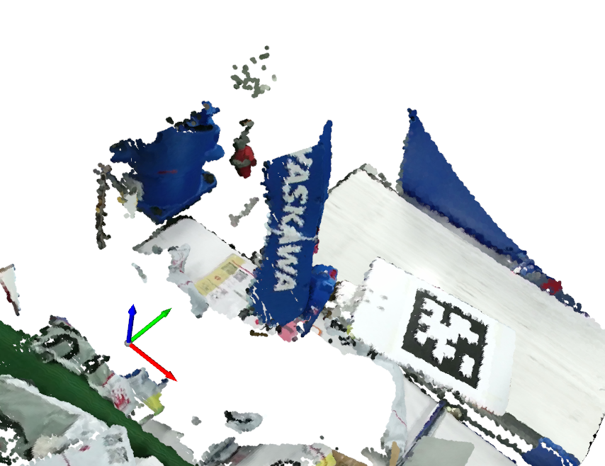
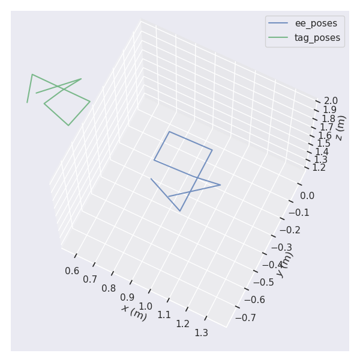
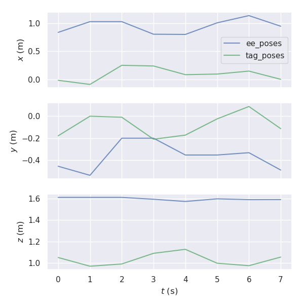
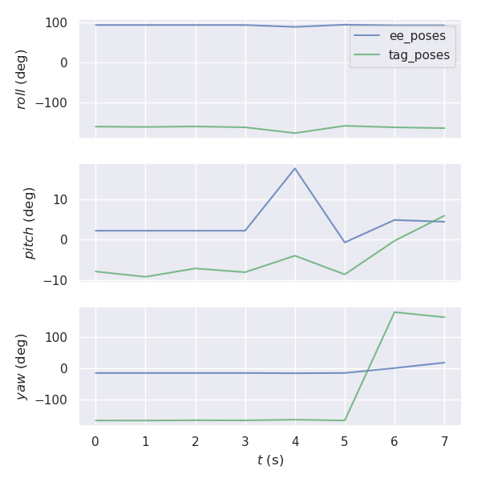
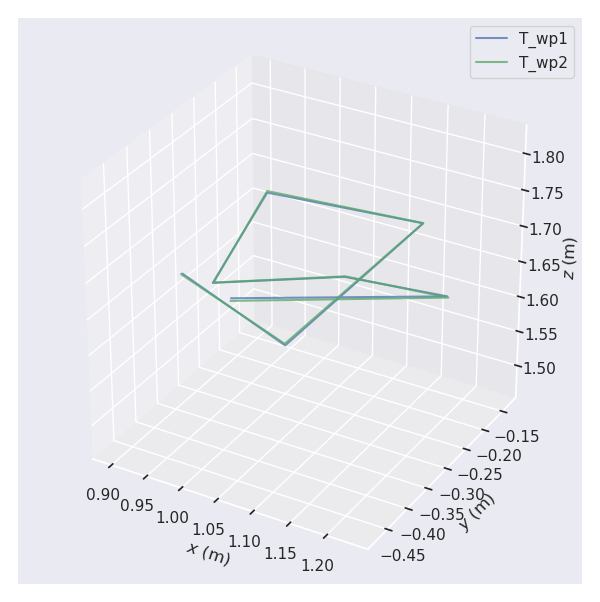
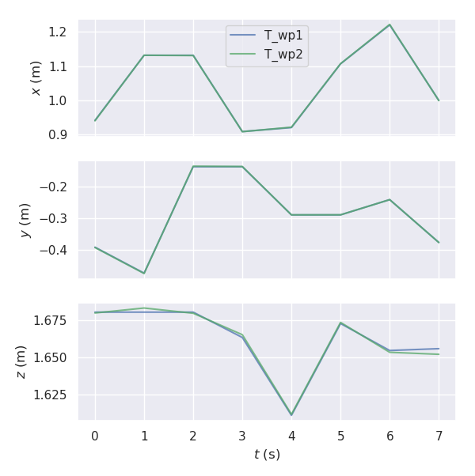
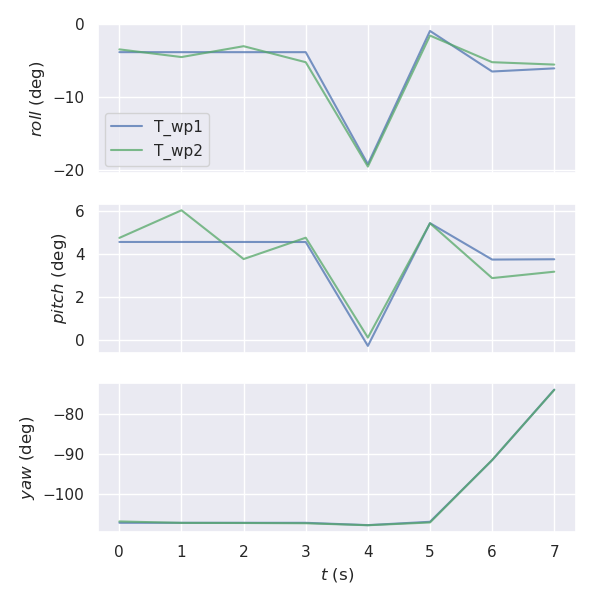

# Hand-eye Extrinsic Calibration

Find the transformation between the robot (hand) and camera (eye).  
In this repo, we show that __6-8 pairs of pointclouds (with calibration board) and robot_base-to-ee poses__ are enough to get a good result.  
Supported Patterns:
- Asymmetric circles
- April tags

## Requirements
You'll __need __ to install the python lib of our open3d fork to use this repo (at least for the pointcloud reading and board detection parts. The optimization bit can be independent).
- __open3d-fork__ (with read_point_cloud_with_nan): http://10.0.9.33:8888/vision/open3d-fork
- numpy
- opencv
- apriltag (pip install apriltag)
- json
- transforms3d

## Examples
__Asymmetric circles:__ `python main_asymm_circle.py`  

__April Tags__ (make sure there is only __one__ tag in the view! Multi tag is not supported): `python main_april_tag.py`  

## Algorithm Details

## Results
### Before

### After

## References
1. [Least-Squares Rigid Motion Using SVD](https://igl.ethz.ch/projects/ARAP/svd_rot.pdf)
2. [Quaternion Averaging](https://ntrs.nasa.gov/archive/nasa/casi.ntrs.nasa.gov/20070017872.pdf)
3. [Unified Temporal and Spatial Calibration for Multi-Sensor Systems](https://furgalep.github.io/bib/furgale_iros13.pdf)